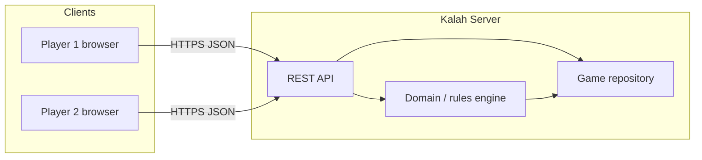

# Kalah Web Game — Architecture

## 1. Goals

- **Two-player** Kalah (6 pits, 4 seeds per pit) over HTTP.
- **Server-authoritative** game rules; clients only render and send `pit_index` moves.
- **Simple deployment**: single JVM, optional horizontal scale behind a load balancer with sticky sessions or shared store (future).

## 2. Context (C4 — Container)

| Container | Responsibility |
|-----------|------------------|
| REST API | Authentication boundary, DTO mapping, HTTP status mapping |
| Domain | Board layout, move legality, sowing, capture, extra turn, game over |
| Repository | Persistence of `KalahGame` by id; MVP: in-process map |

## 3. Layering (hexagonal / ports & adapters)

| Layer | Packages | Depends on |
|-------|----------|------------|
| **domain** | `...domain` | JDK only |
| **application** | `...application` | domain |
| **adapter.in.web** | `...adapter.in.web` | application, Spring Web (controllers only) |

- **Domain** holds `KalahGame`, `Board`, `PlayerSide`, `GameStatus`, and pure functions / methods for applying moves.
- **Application** orchestrates: create game, join by invite, get state, apply move; transactional boundaries around load → domain → save.
- **Adapters** map HTTP ↔ application commands and map domain errors → HTTP status + `error.code`.

## 4. Board model (canonical)

Linear array of **14** positions (fixed in code):

| Index | Meaning |
|-------|---------|
| 0–5 | South row pits |
| 6 | South Kalah (store) |
| 7–12 | North row pits |
| 13 | North Kalah (store) |

Sowing is **counter-clockwise**. While sowing, the **opponent’s Kalah is skipped** (no seed dropped there).

`pit_index` in the API is always **0–5 on the mover’s home row** (relative). The server maps South → indices `0–5`, North → `7–12`.

## 5. API surface (summary)

| Method | Path | Purpose |
|--------|------|---------|
| `POST` | `/api/v1/games` | Create game (host becomes South); returns `invite_code` |
| `POST` | `/api/v1/games/join` | Second player joins with `invite_code` |
| `GET` | `/api/v1/games/{id}` | Current state for authenticated player |
| `POST` | `/api/v1/games/{id}/moves` | Submit move `{ "pit_index": 0..5 }` |

**Authentication (MVP):** `Authorization: Bearer <user-uuid>` — opaque user id for demos and tests. Replace with JWT validation in production.

## 6. Non-functional requirements

| Concern | MVP choice | Future |
|---------|------------|--------|
| Persistence | In-memory `ConcurrentHashMap` | JDBC/JPA + PostgreSQL |
| Real-time | Client polling `GET` | WebSocket or SSE channel per game |
| Auth | Bearer = user id | OAuth2 / JWT with claims |
| Scaling | Single instance | Sticky sessions or Redis-backed repository |

## 7. ADRs

### ADR-001: In-memory repository for MVP

**Decision:** Ship with `InMemoryGameRepository` implementing a small port interface.

**Consequences:** Fast to build and test; data lost on restart; not suitable for multi-instance without replacement.

### ADR-002: Domain-first rules in plain Java

**Decision:** No Spring in domain; rules tested without the container.

**Consequences:** Clear tests; easy to swap HTTP or persistence later.

### ADR-003: Relative `pit_index` in API

**Decision:** Clients always send 0–5 for “my row” from their perspective.

**Consequences:** Less client bug surface; server maps to absolute indices.

## 8. Error mapping

| Domain / validation | HTTP | `error.code` |
|---------------------|------|----------------|
| Not found | 404 | `not_found` |
| Not a player | 403 | `forbidden` |
| Wrong turn / illegal move | 409 | `conflict` |
| Validation (JSON, range) | 422 | `validation_error` |

## 9. Testing strategy

- **Unit tests:** `KalahRules` / `KalahGame` — sowing, skip opponent Kalah, extra turn, capture, game over, scoring.
- **Slice tests:** `@WebMvcTest` or `@SpringBootTest` with `MockMvc` for controllers (optional follow-up).
